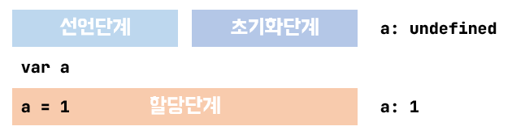
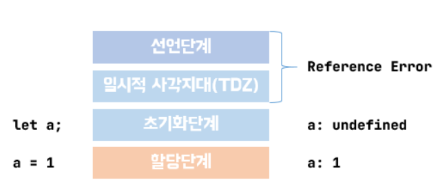
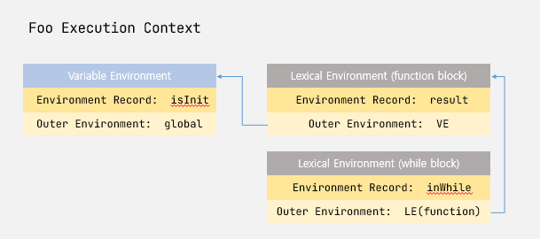

자바스크립트에서 변수를 선언하는 방법에는 `let`, `const` 그리고 `var` 3가지가 있다. var는 자바스크립트 초창기부터 변수를 선언하는 방법이고 let, const는 ES6에서 추가되었다. 어떠한 차이들이 있는지 한번 알아보자.

## 1. var에 대하여

`var`는 ES5까지 자바스크립트에서 변수를 선언하는 유일한 키워드였다. `var`는 다음과 같은 특징이 있다.

- 함수 레벨 스코프
- 변수 호이스팅 발생
  - ES6이전에는 실행컨텍스트 VO(Variable Object)라는 곳에 저장
  - ES6이후로는 VE(Variable Environment)라는 곳에 저장

변수는 선언단계 초기화단계 할당단계로 나눌수 있는데, `var` 같은 경우 선언과 동신에 `undefined`라는 값으로 초기화가 된다.

```js
// a가 호이스팅으로 선언과 동시에, undefined값으로 할당이되어
// 에러가 나지 않고 undefined를 출력해준다.
console.log(a) // undefined  (선언 및 초기화 호이스팅)

var a
console.log(a) // undefined

a = 1 // 할당
console.log(a) // 1
```



함수 스코프라는 특성때문에 아래와같이 for문이 끝나도 값이 유지가 되는것을 확인할 수 있다.

```js
function foo() {
  for (var i = 0; i < 10; i++) {}
  console.log(i) // 10  for문이 끝났음에도 i가 10으로 유지
}
foo()
console.log(i) // i is not defined 에러 발생
```

## 2. let, const 대하여

`let`, `const`는 ES6에 등장한 변수선언 키워드이다.

- 블록 레벨 스코프
- 변수 호이스팅 발생
  - 선언 전에 호출시 에러 발생(TDZ)
  - 실행컨텍스트 LE(Lexical Environment)라는 곳에 저장

`let` , `const` 변수들도 실행컨텍스트 생성단계에서 메모리에 매핑이 일어나면서 호이스팅이 일어나지만 `var` 변수와 달리 초기화단계가 일어나지 않는다. 그래서 '초기화전에는 접근 할 수 없다'는 `ReferenceError` 가 발생한다.

```js
// a가 호이스팅으로 선언
console.log(a) // ReferenceError: Cannot access 'a' before initialization

let a // undefined값으로 초기화
console.log(a) // undefined

a = 1 // 할당
console.log(a) // 1
```


`let`과 `const` 차이는 무엇일까?

바로 재할당이다. `let`은 재할당에 자유롭고, `const`는 값을 재할당 할수없다. 그래서 변하지 않는값에는 `const`를 사용한다.

- `const` 값을 재할당 할 수 없기때문에 초기값을 입력해주어야한다. 입력하지 않을 경우 `SyntaxError`가 발생한다.
- 주소값을 참조하는 객체나 배열은 참조가 변하지 않는 선에서 값을 재할당 할 수 있다.(ex: 객체 프로퍼티 수정, 배열 요소 수정)

```js
const a // SyntaxError: Missing initializer in const declaration

const a = 1
a = 2 // TypeError: Assignment to constant variable.

let a // SyntaxError: Identifier 'a' has already been declared

let c
c = 1 // let은 재할당이 가능하다.

const obj = {}
obj.a = 1 // 참조 주소값이 변하지 않는 경우 수정이 가능하다.
obj = { b: 2 } // TypeError: Assignment to constant variable.

const arr = []
arr.push(1) // [1]
arr = arr.map((d) => d * 2) // TypeError: Assignment to constant variable.
```

블록 레벨 스코프라는 특성때문에 아래와같이 `for`문이 끝나면 `var`와 다르게 변수가 유지되지 않는 것을 확인 할 수 있다.

```js
function foo() {
  for (let i = 0; i < 10; i++) {}
  console.log(i) // i is not defined 에러 발생
}
foo()
```

어떻게 블록단위로 변수 선언이 될 수 있는 것일까?

위에서 `let, const`는 LE라는 곳에 저장 된다고 말했다. LE의 구조는 크게 Environment Record와 Outer Refernce로 나눠지는데 변수는 Environment Record에 저장이 되고, Outer Refernce는 상위 블록을 가르키게 된다.

동작방식은 새로운 블록을 만날떄마다 LE 환경이 새로 생기게되고 Outer Rerference는 상위블록을 가르키게되고 블록이 끝났을경우 해당 LE환경이 사라지게 된다.

```js
function foo() {
  var isInit = true
  let result = 'init'

  while (isInit) {
    let inWhile = 'while'
    console.log(result, inWhiel) // init, while
    isInit = false
  }
}

foo()
```



위 코드를 보면 foo() 함수 실행시 foo 실행컨텍스트가 생성된다.

VE에는 `var`로 선언한 isInit이 매핑된다.

LE는 fuction block에는 result가 매핑이 되고, while block에는 inWhile이 매핑되고 상위 스코프 function block을 바라보게 된다.

## 3. var, const, let 무엇을 써야 하나?

기본적으로 ES6+ 환경에서는 변수 선언은 `const`를 사용하고, 재할당이 필요한 경우에는 `let`을 사용 하는 것이 안전하고 좋다. `var`는 ES5 환경에서 사용하도록 하자. 마지막으로 객체나 배열은 보통 재할당 하지 않는 경우가 많기에 `const`로 우선적으로 선언해서 사용하는것이 좋다. 추후에 재할당이 필요할 경우 그때 사용해도 늦지 않으니 `const`를 사용하자.

## Reference

[https://poiemaweb.com/es6-block-scope](https://poiemaweb.com/es6-block-scope)

[https://dkje.github.io/2020/08/30/ExecutionContext/](https://dkje.github.io/2020/08/30/ExecutionContext/)
