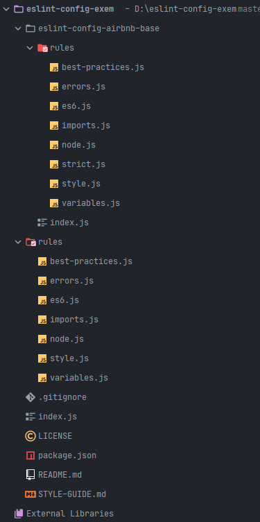

## 1. ESLint란?

ECMA Scirpt + Lint 합성어로 자바스크립트 문법중에 에러가 있는 곳에 표시를 알려주는 도구입니다. 많은 회사들이 ESLint로 스타일 가이드를 지정하고 사용하고 있으며 대표적으로 [Airbnb Style Guide](https://github.com/airbnb/javascript)와 [Google Style Guide](https://github.com/google/eslint-config-google)들이 있습니다.

## 2. 왜 Style Guide를 만들었을까?

우리 팀은 Airbnb 스타일 가이드를 지속적으로 사용하면서 불편하거나 불필요한 부분들을 팀에 맞게 수정하여 사용하고 있습니다.

- 새로운 프로젝트 환경 구성시 매번 기존 프로젝트 룰을 가져와서 추가하는 작업
- 새로운 구성원에게 스타일 가이드 설명시 어려움

위와 같은 불편한 점들이 느끼게 되었고, 회사 Style Guide를 만들어 보면 좋지 않을까 해서 진행했습니다.

꼭 위와 같은 상황이 아니더래도 개인 프로젝트 진행시 일관된 코드를 유지하고 싶으면 한번쯤 개인용 스타일 가이드를 만들어도 좋을거 같습니다.

## 3. ESLint 룰 만들기(Extend)

### 1) esling-config-[사용할이름] name을 가진 packasge.json만들기

```json
{
  "name": "eslint-config-exem", // eslint-conifg-[사용할이름]
  "version": "3.0.3", // 배포시 버전
  "description": "Exem JavaScript Coding Conventions rules for eslint",
  "main": "index.js", // 초기 진입 파일
  "dependencies": {
    "eslint": "^7.2.0",
    "eslint-plugin-import": "^2.21.2" // import / export 구문의 린팅 지원 플러그인
  },
  "repository": {
    // 레포 정보
    "type": "git",
    "url": "https://github.com/ex-em/eslint-config-exem.git"
  },
  "author": "EXEM",
  "license": "MIT"
}
```

먼저 위와 같은 구조로 package.json을 만듭니다.

### 2) 폴더 구조

기존에 Airbnb룰을 토대로 사용했기에 Airbnb룰을 그대로 가져와 추가하는 형태로 진행했습니다. 처음 룰을 만드시는 분이라면 무작정 처음부터 추가하는 것보다 `Airbnb`룰 셋을 가져와서 써보면서 불편하거나 나에게 맞는 스타일 룰을 수정 하는 방법이 좋습니다.



- eslint-config-airbnb-base : airbnb js base 최신룰을 가져왔습니다.
- rules : Airbnb 룰셋 파일별로 룰을 수정하기 위해서 Airbnb룰 파일 구조 그대로 만들었습니다.
- index.js : 메인 진입 파일 airbnb 룰셋과 수정한 rules를 합치는 작업을 합니다.
- [README.md](http://readme.md) : 사용 방법 작성하였습니다.
- [STYLE-GUIDE.md](http://style-guide.md) : Airbnb룰(한글)을 토대로 룰 수정부분을 고쳐 작성하였습니다.

### 3) 파일

index.js에서 extends 순서가 중요합니다. 똑같은 룰셋의 경우 마지막으로 선언한 값으로 인식 되기 때문에 Airbnb룰셋을 가장 먼전 선언해주었습니다.

```jsx
// index.js
module.exports = {
  extends: [
    './eslint-config-airbnb-base/index',
    './rules/best-practices',
    './rules/errors',
    './rules/node',
    './rules/style',
    './rules/variables',
    './rules/es6',
    './rules/imports',
  ].map(require.resolve),
  env: {
    browser: true,
  },
}

// rules/style.js
// airbnb 룰에서 수정이 필요한 부분들만 정의
// 샘플예제입니다.
module.exports = {
  rules: {
    'no-plusplus': 'off',
    'linebreak-style': ['error', 'windows'],
    'comma-dangle': [
      'error',
      {
        arrays: 'always-multiline',
        objects: 'always-multiline',
        imports: 'always-multiline',
        exports: 'always-multiline',
        functions: 'never',
      },
    ],

    'func-names': 'off',
  },
}
```

### 4) 스타일 가이드 문서

[스타일 가이드 문서](https://github.com/ex-em/eslint-config-exem/blob/master/STYLE-GUIDE.md)는 Airbnb Stytle Guide 문서를 번역 하면서 작성을 하던 중 이미 한글 번역본을 발견하여 [한글 번역본](https://github.com/ParkSB/javascript-style-guide) 토대로 작성하였습니다.

### 5) 배포

package.json에서 버전을 올리고 `npm pulish` 명령어로 배포하였습니다.

배포에 관련된 자세한 내용은 [HEROPY Tech 블로그](https://heropy.blog/2019/01/31/node-js-npm-module-publish/)를 참고 하면 좋을거 같습니다.

## 4. 배포한 룰 사용하기

### 1) `eslint-config-[사용할이름]` npm 추가를 해줍니다.

```bash
$ npm install eslint eslint-config-exem --save-dev
```

### 2) `.eslintrc.js` 파일에서 extends에 사용할이름을 추가해주면 됩니다.

```jsx
module.exports = {
  extends: 'exem', // eslint-config-[사용할이름] 사용할이름을 넣으면된다. 다른 룰도 같이 사용시 ['exem', ....]배열로 선언해주면 된다.
  rules: {
    // 프로젝트 추가할 룰들
    // 아래예시는 개발 편의를 위해 개발시에는 콘솔과 디버거 에러를 끈다.
    'no-console': process.env.NODE_ENV === 'production' ? 'warn' : 'off',
    'no-debugger': process.env.NODE_ENV === 'production' ? 'warn' : 'off',
  },
}
```

## 5. 진행하면서 느낀점

린트를 처음 사용할 시 Airbnb룰을 무작정 적용하고 에러를 보고 수정하면서 했었는데, 당시에 Style Guide를 먼저 정독해보면 좋았을거 같다고 생각했습니다. 지금이라도 문서를 작성하면서 읽어봐서 좋았습니다.

매번 프로젝트 만들면서 린트룰을 설정하고 계신다면 이 참에 한 번 정리해서 스타일 룰셋을 만들어 보는것을 추천드립니다.
